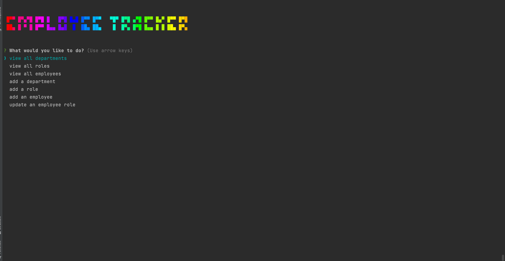

# Employee Tracker
unlicensed
    
## Description
this project is a command-line application to manage a company's employee database, using Node.js, Inquirer, and MySQL.  
[project link](https://github.com/gfernandez25/employee-tracker)

## Table Of Contents
* [Installation](#user-content-installation)
* [Usage](#user-content-usage)
* [Licenses](#user-content-licenses)
* [Tests](#user-content-tests)
* [Questions](#user-content-questions)
    
## Installation
1. install npm
2. install install npm Inquirer
3. install MySQL2

## Usage
download files and run node index.js

[how to video](https://drive.google.com/file/d/1_yCP2-02XIHb7elWnoIx7RXLmefchlO_/view)
## Screenshot

## License

unlicensed
    
## Contributing
contribute as you can
 
## Tests
manual test only

## Questions
for any questions please check out my GitHub profile: [gfernandez25](https://github.com/gfernandez25)  

